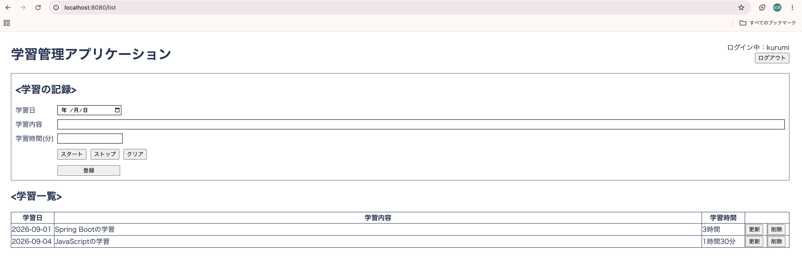

# 学習管理アプリケーション

Spring Bootを使用して作成した、学習記録を管理するWebアプリケーションです。

## 主な機能

- 学習記録の登録
- 学習記録の一覧表示
- 学習記録の更新
- 学習記録の削除
- ユーザー登録機能
- ログイン・ログアウト機能
- ユーザーごとの学習記録管理
- 学習時間のタイマー機能

## 使用技術

- Java 21
- Spring Boot
- Spring Security
- Thymeleaf
- H2 Database
- HTML
- CSS
- JavaScript
- Maven

## 画面イメージ

