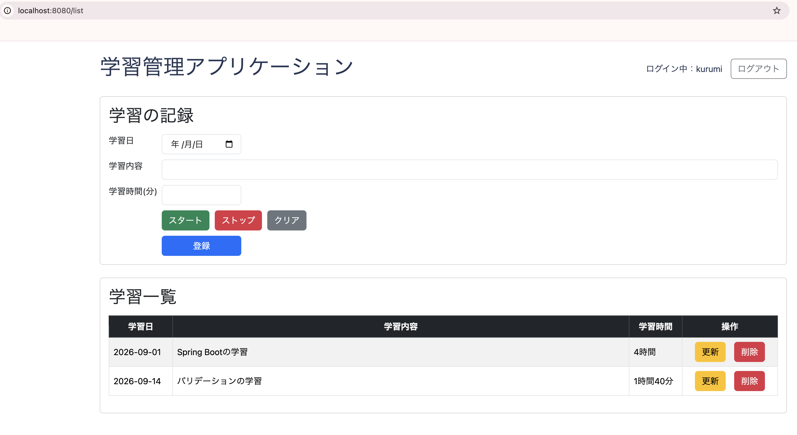

# 学習管理アプリケーション

## アプリ概要

Spring Bootを使用して作成した、学習記録を管理するWebアプリケーションです。

学習日・学習内容・学習時間を記録し、登録した学習記録の確認・更新・削除ができます。
また、ユーザー登録・ログイン機能を実装しており、ユーザーごとに自分の学習記録を管理できます。

## 主な機能

- 学習記録の登録
- 学習記録の一覧表示
- 学習記録の更新
- 学習記録の削除
- ユーザー登録機能
- ログイン・ログアウト機能
- ユーザーごとの学習記録管理
- 学習時間のタイマー機能
- 入力バリデーション機能

## 工夫した点

- ユーザーごとに自分の学習記録のみを表示・管理できるようにしました。
- 学習記録やユーザー登録時にバリデーションを行い、不正な値が登録されないようにしました。
- 学習時間を手入力するだけでなく、タイマーを使って計測できるようにしました。
- Spring Securityを使用し、ログイン認証とパスワードのハッシュ化を実装しました。

## 使用技術

- Java 21
- Spring Boot
- Spring Security
- Thymeleaf
- H2 Database
- HTML
- CSS
- JavaScript
- Bootstrap
- Maven

## 今後追加したい機能

- 学習時間の合計・集計機能

## 画面イメージ

